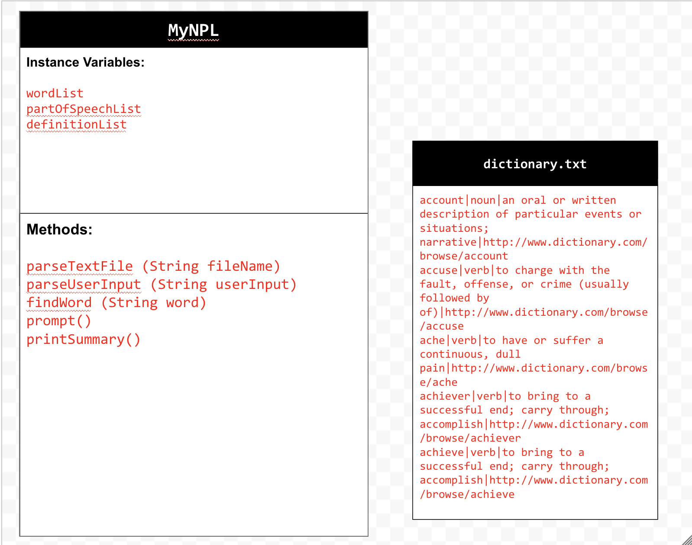
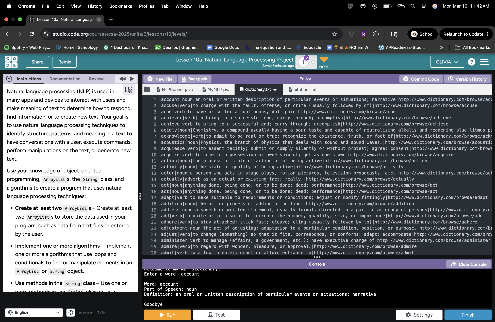

# Unit 6 - Natural Language Processing Project

## Introduction

Natural language processing (NLP) is used in many apps and devices to interact with users and make meaning of text to determine how to respond, find information, or to create new text. Your goal is to use natural language processing techniques to identify structure, patterns, and meaning in a text to have conversations with a user, execute commands, perform manipulations on the text, or generate new text.

## Requirements

Use your knowledge of object-oriented programming, ArrayLists, the String class, and algorithms to create a program that uses natural language processing techniques:

- **Create at least two ArrayLists** – Create at least two ArrayLists to store the data used in your program, such as data from text files or entered by the user.
- **Implement one or more algorithms** – Implement one or more algorithms that use loops and conditionals to find or manipulate elements in an ArrayList or String object.
- **Use methods in the String class** - Use one or more methods in the String class in your program, such as to divide text into sentences or phrases.
- **Use at least one natural language processing technique** – Use a natural language processing technique to process, analyze, and/or generate text.
- **Document your code** – Use comments to explain the purpose of the methods and code segments and note any preconditions and postconditions.

## UML Diagram

Put an image of your UML Diagram here. Upload the image of your UML Diagram to your repository, then use the Markdown syntax to insert your image here. Make sure your image file name is one word, otherwise it might not properly get displayed on this README.hnu

## Video

Record a short video of your project to display here on your README. You can do this by:

- Screen record your project running on Code.org.
- Upload that recording to YouTube.
- Take a thumbnail for your image.
- Upload the thumbnail image to your repo.
- Use the following markdown code:

## Project Description

This application is designed to act as a dictionary tool that helps users understand the meaning and grammatical role of words they enter. It analyzes text from a structured file (dictionary.txt), where each line contains a word, its part of speech, and its definition separated by pipe (|) symbols. When the user inputs a word or sentence, the program breaks the text into individual lowercase words and searches for each one in the stored dictionary data. The user interacts with the program through the console, receiving definitions and parts of speech for any matching words found.

## NLP Techniques

This project implements a basic Natural Language Processing technique called tokenization, which involves breaking down user input into individual words for analysis. The parseUserInput method is responsible for this process, as it splits the user’s sentence by spaces and converts each word to lowercase, creating a list of tokens that can be processed consistently. Another important method is findWord, which uses these tokens to perform a dictionary lookup, matching each word against stored data to retrieve its part of speech and definition. Additionally, the parseTextFile method supports the NLP process by organizing structured text data from a file into usable components, making it possible for the program to analyze and respond to user input effectively.